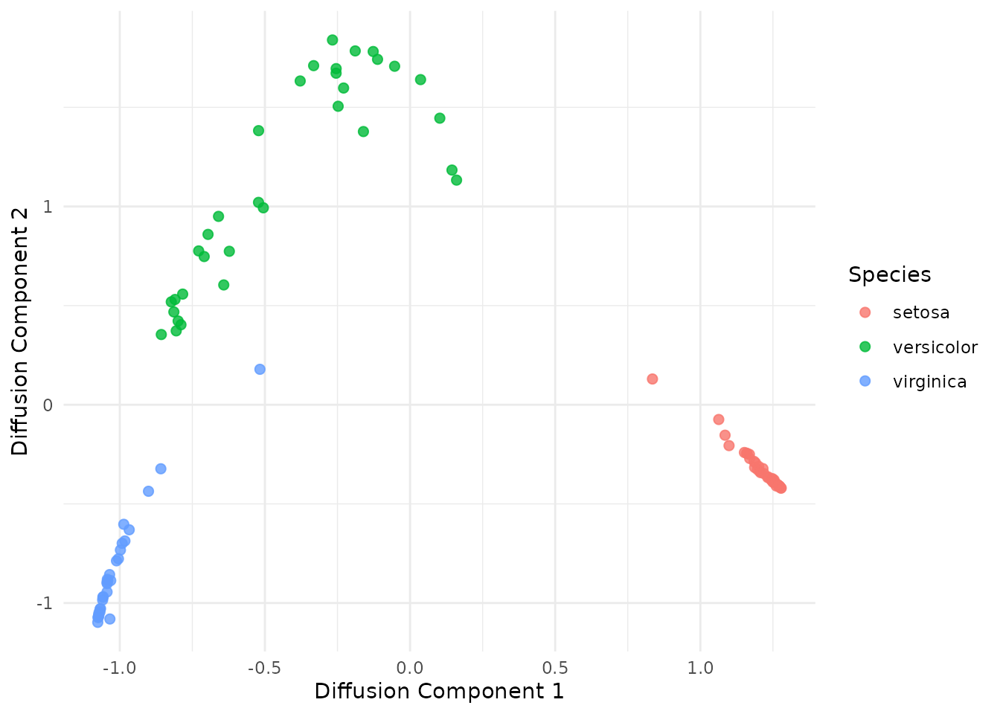
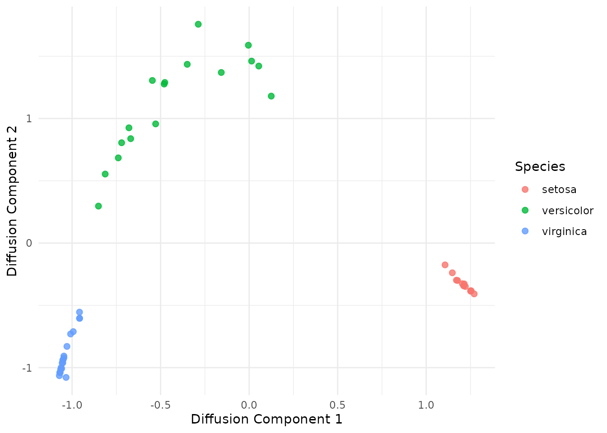
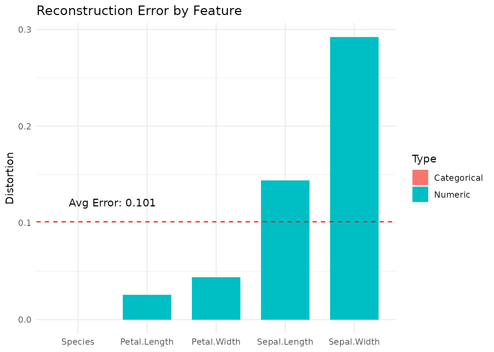

# Autoencoding Random Forests

Autoencoding Random Forests (RFAE) provide a framework for
dimensionality reduction and data reconstruction using the leaf-node
connectivity of Random Forests. This vignette demonstrates the
three-step pipeline:

1.  Training a base Random Forest (RF).

2.  Encoding data into low-dimensional embeddings.

3.  Decoding those embeddings back into the original input space.

## Random Forest Training

Rather than being trained end-to-end, the RFAE algorithm is more like a
post-processing procedure on a trained Random Forest (RF), so first we
need to train a RF.

Unlike standard autoencoders, RFAE is essentially a post-processing
procedure applied to a pre-trained Random Forest - so first, we need to
train a RF.

Given a dataset of interest, you must decide whether to train the Random
Forest (RF) in a supervised or unsupervised manner.

1.  Supervised Learning: Uses a target class label to guide tree splits
    (default in ranger). Subsequently, this label will be excluded from
    the subsequent encoding/decoding steps.

2.  Unsupervised Learning: Uses variants like Adversarial Random Forests
    (ARF) ([Watson et al.,
    2023](https://proceedings.mlr.press/v206/watson23a.html)) or
    Unsupervised RFs (URF) ([Shi & Horvath,
    2006](https://www.tandfonline.com/doi/abs/10.1198/106186006X94072)),
    or others. These allow the model to learn the data’s structure
    without a target label. For example, an ARF learns the data
    distribution by training the model to distinguish between real
    observations and synthetically generated dummy data in an
    adversarial manner.

RFAE is compatible with ranger-like objects. It can be implemented using
either the standard `ranger` package for supervised models or the
adversarial_rf function from the `arf` package for unsupervised
applications. You can also build other variants from `ranger`; please
refer to their
[documentation](https://www.rdocumentation.org/packages/ranger) for more
details.

``` r
# Load libraries
library(RFAE)
library(data.table)
library(ggplot2)
library(arf)
library(ranger)
set.seed(42)

# Train-test split
trn <- sample(1:nrow(iris), 100)
tst <- setdiff(1:nrow(iris), trn)

# Train a RF and an ARF
rf <- ranger(Species ~., data = iris[trn, ], num.trees=50)
arf <- adversarial_rf(iris[trn, ], num_trees = 50, parallel = FALSE)
#> Iteration: 0, Accuracy: 80.5%
#> Iteration: 1, Accuracy: 39%
```

We can speed up computations by registering a parallel backend, which
can be used by `ranger` and `arf`, as well as the later functions in the
pipeline. The default behavior of all functions is to compute in
parallel, if possible, so it is advised to do so. How this is done
varies across operating systems.

``` r
# Register cores - Unix
library(doParallel)
registerDoParallel(cores = 2)
```

Windows requires a different setup.

``` r
# Register cores - Windows
library(doParallel)
cl <- makeCluster(2)
registerDoParallel(cl)
```

In either case, we can now execute in parallel.

``` r
# Rerun in parallel
arf <- adversarial_rf(iris[trn, ], num_trees=50)
#> Iteration: 0, Accuracy: 82.5%
#> Iteration: 1, Accuracy: 34%
#> Warning: executing %dopar% sequentially: no parallel backend registered
rf <- ranger(Species ~., iris[trn, ], num.trees=50)
```

The result of either functions is an object of class `ranger`, which we
can input into the autoencoding pipeline.

## Encoding Stage

The next step is to train the model to encode the data, using `encode`.
This function first computes the adjacency matrix between training
samples implied by the `rf`. Samples are considered similar if they are
routed into the same leaves often throughout the forest.

The `encode` function requires a `ranger` object, the training data `x`
and a parameter `k` for the dimensionality of the embeddings. You can
also set `stepsize`, an integer which controls the number of time steps
in the diffusion process, and governs whether you want local or global
connectivity captured in your embedding. The default value is 1, which
gives the most local connectivity; increasing this allows the
information captured by the embeddings to be more global (see
[here](https://en.wikipedia.org/wiki/Diffusion_map) for more details .

The function outputs a list of length 8, containing `Z`, a
`k`-dimensional non-linear embedding of `x` implied by `rf`; `A`, the
adjacency matrix; and other information from the encoding process to aid
with later steps.

For large datasets, this function can be very computationally expensive,
as it requires at least $\mathcal{O}(n^{2})$ space for the adjacency
matrix, where $n$ is the sample size.

``` r
# One encoding for each type of RF
# We choose k=2 to allow visualisation
emap_arf <- encode(arf, iris[trn, ], k=2)
emap_rf <- encode(rf, iris[trn, ], k=2)

# Print out first five rows of embeddings
# The first five rows of x
iris[trn, ][1:5, ]
#>     Sepal.Length Sepal.Width Petal.Length Petal.Width    Species
#> 49           5.3         3.7          1.5         0.2     setosa
#> 65           5.6         2.9          3.6         1.3 versicolor
#> 74           6.1         2.8          4.7         1.2 versicolor
#> 146          6.7         3.0          5.2         2.3  virginica
#> 122          5.6         2.8          4.9         2.0  virginica
# The first five embedded samples for ARF
emap_arf$Z[1:5, ]
#>            [,1]       [,2]
#> [1,]  1.2704512 -0.4084505
#> [2,] -0.1889004  1.7847433
#> [3,] -0.6598193  0.9501371
#> [4,] -1.0590509 -0.9845285
#> [5,] -0.9011168 -0.4363258
# The first five embedded samples for RF
emap_rf$Z[1:5, ]
#>            [,1]        [,2]
#> [1,]  1.3036159 -0.01481178
#> [2,] -0.7523194  1.18412051
#> [3,] -0.7525884  1.18012453
#> [4,] -0.7822414 -1.34539845
#> [5,] -0.7810238 -1.23921453
```

We find a slightly different set of embeddings due to the introduction
of the Species column into the training stage of the ARF.

Moving forward in the vignette, we will only use the `emap_arf`
encodings for the pipeline to avoid repeating. In practice, the user
should decide whether they want to have supervised embeddings (which may
be more useful in feature engineering for classification/regression) or
unsupervised (which may be more useful in data analysis).

``` r
# Plot the embedded training data
tmp <- data.frame(
  dim1 = emap_arf$Z[, 1],
  dim2 = emap_arf$Z[, 2],
  class = iris[trn, ]$Species
)
ggplot(tmp, aes(x = dim1, y = dim2, color = class)) +
  geom_point(size = 2, alpha = 0.8) +
  theme_minimal() +
  labs(
    x = "Diffusion Component 1",
    y = "Diffusion Component 2",
    color = "Species"
  )
```



As we expect, the `iris` data is fairly well separated with two
components. These encodings by themselves can be used for feature
engineering, compression, or clustering, as well as denoising and batch
correction - see [Vu et al., 2025](https://arxiv.org/abs/2505.21441) for
more details.

In addition to the embeddings, `encode` generates an adjacency matrix
`A`, which captures the similarity between training samples as learned
by the RF. This is a doubly-stochastic (rows and columns sum to 1) and
positive semi-definite matrix. This matrix describes the Random Forest
kernel, and can be considered a data-adaptive kernel which works for
mixed-type tabular data, and we can consider it for any kernel method.

``` r
A <- emap_arf$A
A[1:5, 1:5]
#> 5 x 5 sparse Matrix of class "dgCMatrix"
#>                                                              
#> [1,] 0.1437159 .          .           .           .          
#> [2,] .         0.23773016 .           .           0.009523810
#> [3,] .         .          0.212240882 0.001295716 0.002724287
#> [4,] .         .          0.001295716 0.094183542 0.014440392
#> [5,] .         0.00952381 0.002724287 0.014440392 0.193416583
```

With our learned embeddings, which are contained in the `emap` object,
we can also project new data onto the principal components, using
`predict`. Internally, the function passes the testing data through the
RF, which is passed as an argument, computes the adjacency matrix
between training and testing samples, then projects data using the
Nyst"om formula, and returns an embedding matrix of size \$n\_{test} k
\$.

``` r
# Project testing data
emb <- predict(emap_arf, arf, iris[tst, ])

# Plot test embeddings
tmp <- data.frame(
  dim1 = emb[, 1],
  dim2 = emb[, 2],
  class = iris[tst, ]$Species
)

ggplot(tmp, aes(x = dim1, y = dim2, color = class)) +
  geom_point(size = 2, alpha = 0.8) +
  theme_minimal() +
  labs(
    x = "Diffusion Component 1",
    y = "Diffusion Component 2",
    color = "Species"
  )
```

 \# Decoding Stage

After finding the embeddings, we can now use `decode_knn` to decode them
back to the original input space. Given a test embedding, function works
by first finding the `k`-nearest neighbors (kNN) in the embedding space.
Then, these samples are reconstructed using the leaf bounds of the
original RF, following the eForest approach described in [Feng & Zhou,
2018](https://ojs.aaai.org/index.php/AAAI/article/view/11732). Finally,
the sample is reconstructed by taking a weighted average of the
`k`-nearest training samples.

The `decode_knn` function requires 3 arguments: the original `rf` object
used in training, the `z` matrix of embedded data and the `emap` object
outputted via `encode`. Optional arguments include `x_tilde`, which is
`NULL` by default to tell the function to use the eForest approach, but
the exact training data can otherwise be supplied; the `k` parameter for
the kNN approach (default k=5), and a `parallel` flag which is enabled
by default.

The function then returns a list consisting of two data frames: `x_hat`,
which is the reconstructed data frame, and `x_tilde`, the training
samples rebuilt for the decoding process.

``` r
# Decode data
out <- decode_knn(arf, emap_arf, emb)
# Reconstructed testing data
out$x_hat[1:5, ]
#>   Sepal.Length Sepal.Width Petal.Length Petal.Width Species
#> 1          5.1         3.6          1.4         0.2  setosa
#> 2          5.1         3.5          1.4         0.2  setosa
#> 3          4.9         3.1          1.5         0.2  setosa
#> 4          4.9         3.1          1.5         0.2  setosa
#> 5          5.3         3.7          1.5         0.4  setosa
# Original testing data
iris[tst, ][1:5, ]
#>    Sepal.Length Sepal.Width Petal.Length Petal.Width Species
#> 7           4.6         3.4          1.4         0.3  setosa
#> 11          5.4         3.7          1.5         0.2  setosa
#> 12          4.8         3.4          1.6         0.2  setosa
#> 14          4.3         3.0          1.1         0.1  setosa
#> 19          5.7         3.8          1.7         0.3  setosa
```

The reconstructed data in this case is highly similar to the original
data on inspection. `decode_knn`’s post-processing also coerces `x_hat`
to match the format of the original (i.e., same number of decimal points
and same column ordering).

## Reconstruction Error

Of course, beyond inspection, there should be a principled way in which
we can evaluate the quality of reconstructed data. Most existing methods
for autoencoding (and by extension evaluating) are built for numerical
data, so they do not handle mixed-type tabular data in a sensible way -
you can one-hot encode data, but what exactly does that mean in terms of
column to column $R^{2}$?

We provide this in the form of `reconstruction_error`, which takes first
the `Xhat` data frame of reconstructed data, and second the original
`X`. Note that while `decode_knn` outputs columns in the correct order,
this is not actually necessary for `reconstruction_error`. The function
calculates prediction error for categorical features, and 1-$R^{2}$ for
numerical features, both of which are between 0 and 1.

The function then returns a list of 5 elements, with entries for (1)
errors for numerical features; (2) errors for categorical features; (3)
average numerical error; (4) average categorical error; and (5) the
overall average error.

``` r
errors <- reconstruction_error(out$x_hat, iris[tst, ])
# Error in numerical features
errors$num_error
#> $Sepal.Length
#> [1] 0.1440597
#> 
#> $Sepal.Width
#> [1] 0.2922436
#> 
#> $Petal.Length
#> [1] 0.02562121
#> 
#> $Petal.Width
#> [1] 0.04385683
# Error in categorical features
errors$cat_error
#> $Species
#> [1] 0
# Average numerical error
errors$num_avg
#> [1] 0.1264454
# Average categorical error
errors$cat_avg
#> [1] 0
# Overall error
errors$ovr_error
#> [1] 0.1011563
```

``` r

# Plotting the errors by each feature
error_df <- data.frame(
  Variable = c(names(errors$num_error), names(errors$cat_error)),
  Error = c(unlist(errors$num_error), unlist(errors$cat_error)),
  Type = c(rep("Numeric", length(errors$num_error)), 
           rep("Categorical", length(errors$cat_error)))
)

ggplot(error_df, aes(x = reorder(Variable, Error), y = Error, fill = Type)) +
  geom_bar(stat = "identity", width = 0.7) +
  geom_hline(aes(yintercept = errors$ovr_error), 
             linetype = "dashed", color = "red") +
  annotate("text", x = 1.5, y = errors$ovr_error + 0.02, 
           label = paste("Avg Error:", round(errors$ovr_error, 3))) +
  theme_minimal() +
  labs(
    title = "Reconstruction Error by Feature",
    x = NULL,
    y = "Distortion"
  )
```


